## Welcome to the Dierickx Lab for Circadian Regulation of Cardiometabolism
{:.center}

 

Circadian rhythms coordinate many different aspects of behavior and physiology (e.g., fasting/feeding cycles, body temperature and metabolism). The Dierickx lab is interested in the molecular mechanisms of the circadian clock driving rhythmic metabolic processes in the heart. We try to understand how deregulated clocks are leading to cardiovascular defects and are trying to target the circadian clock in order to treat and prevent heart diseases.

<head>
<!-- Start WOWSlider.com HEAD section -->
<link rel="stylesheet" type="text/css" href="engine1/style.css" />

<!-- End WOWSlider.com HEAD section -->
 </head>

<body style="background-color:#202020;">
<!-- Start WOWSlider.com BODY section -->

<ul>
		<li>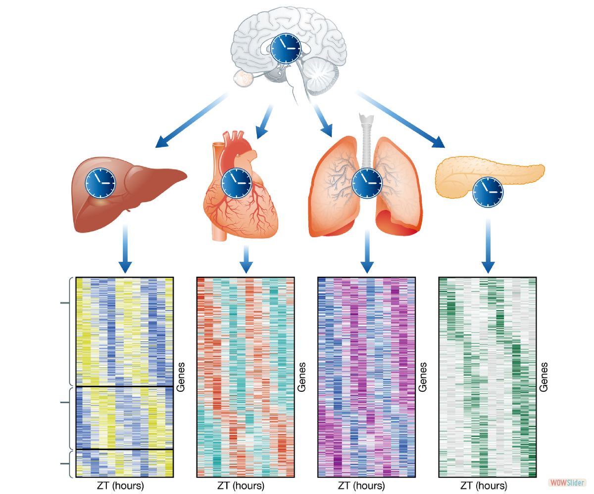</li>
		<li></li>
		<li>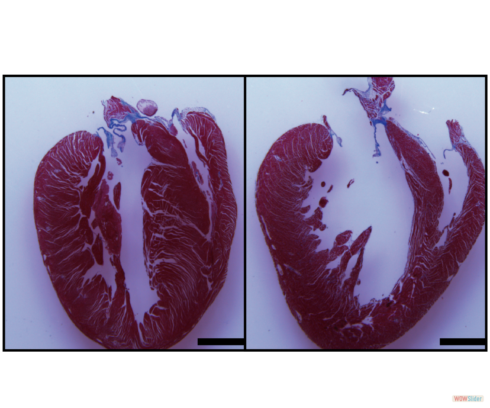</li>
		<li>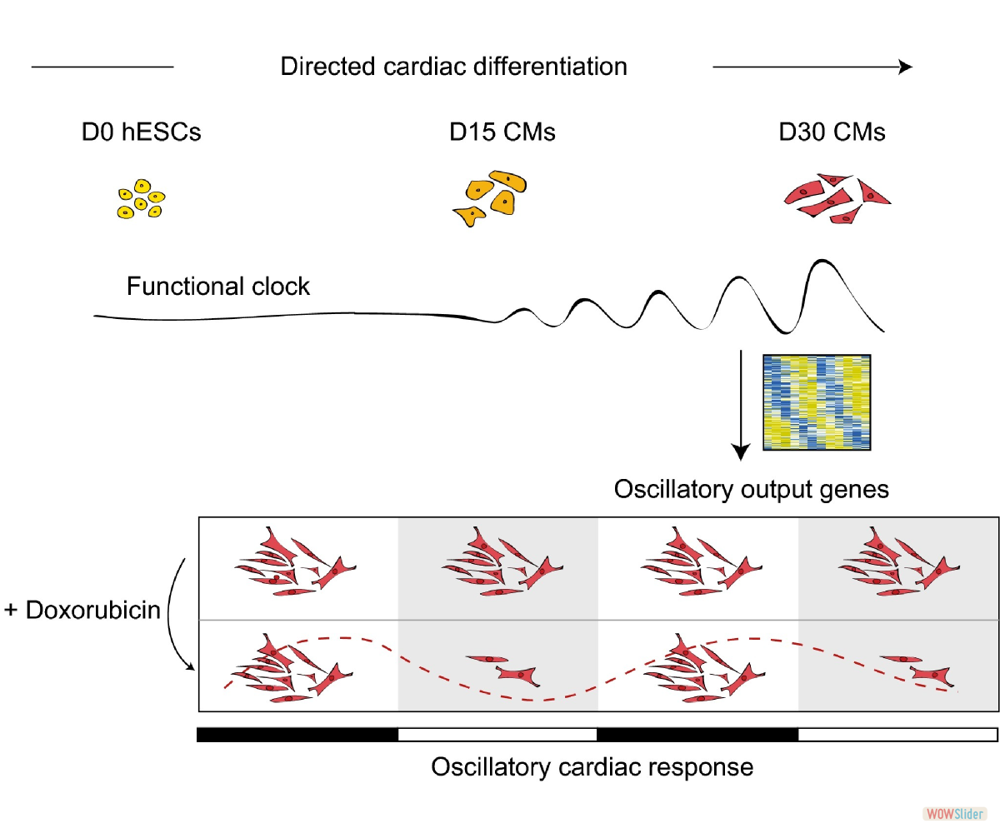</li>
		<li>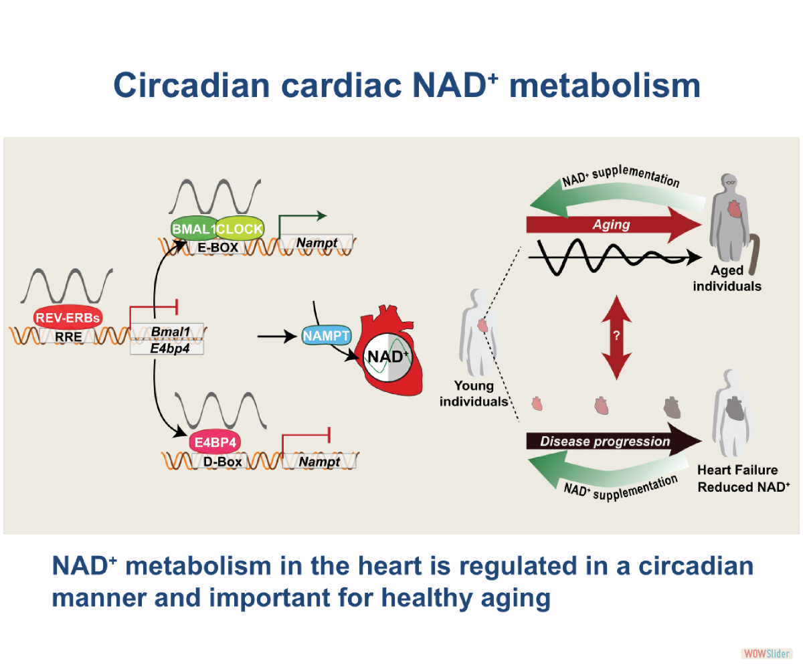</li>
		<li>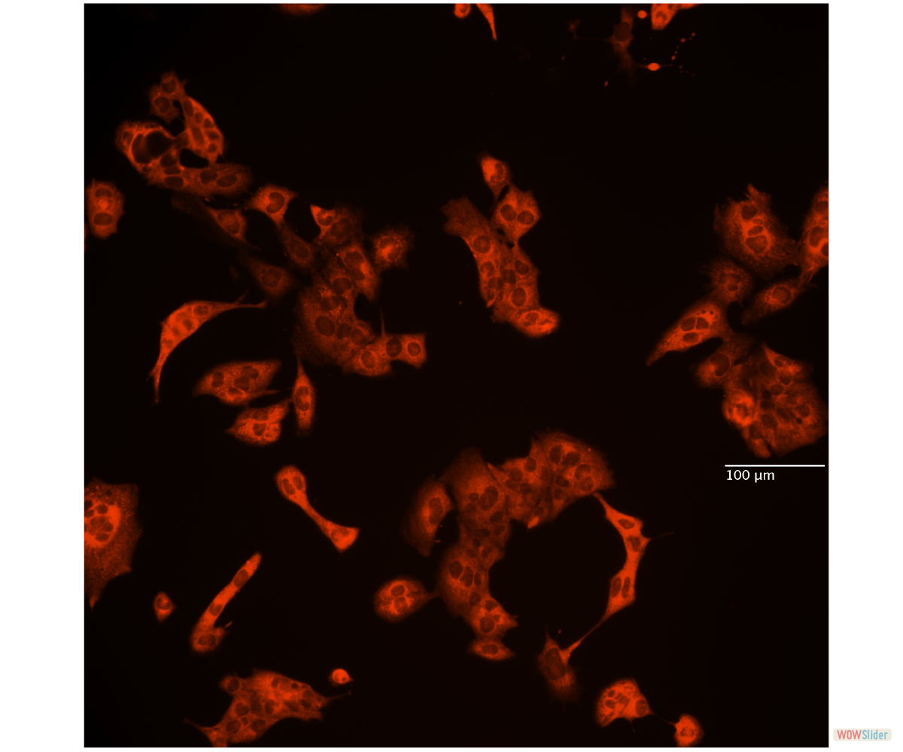</li>
		<li>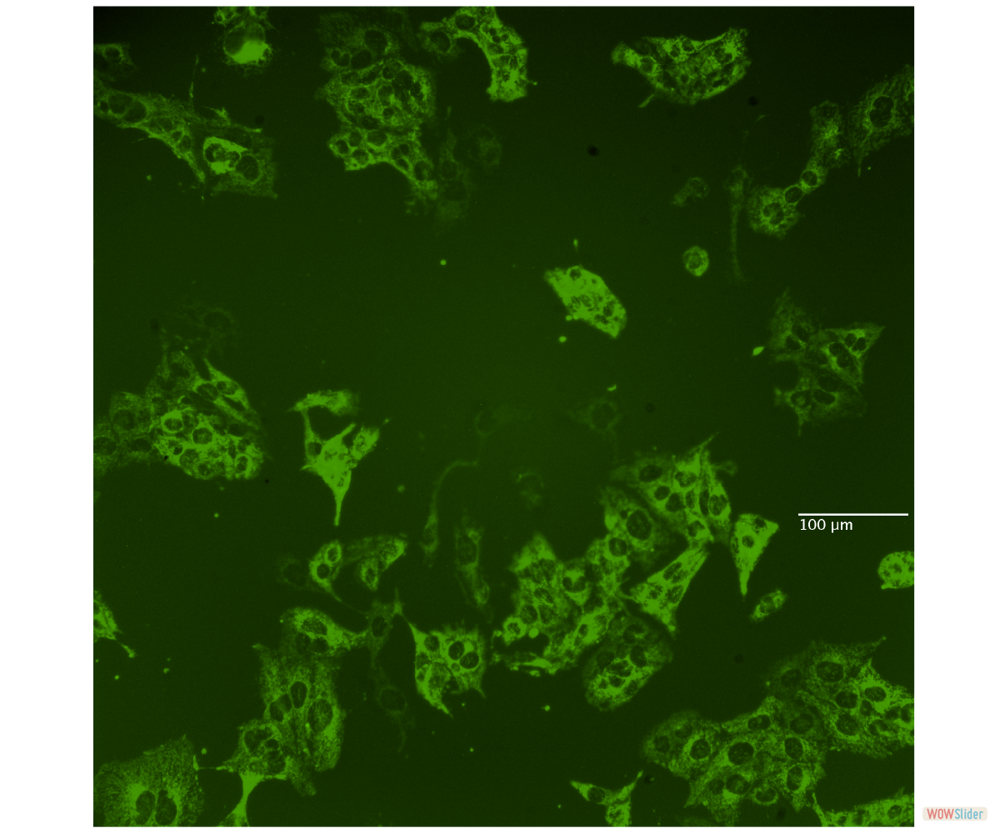</li>
		<li>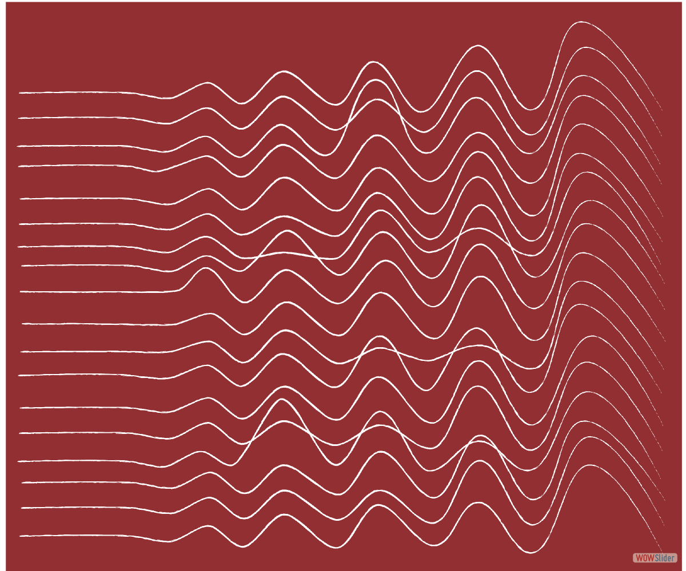</li>
		<li>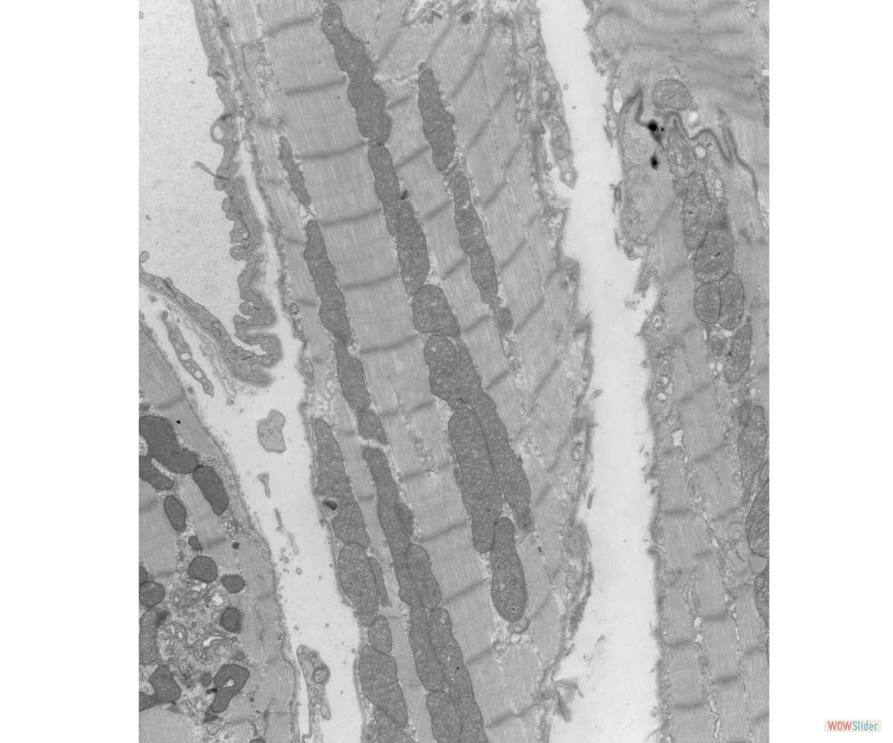</li>
		<li></li>
		<li>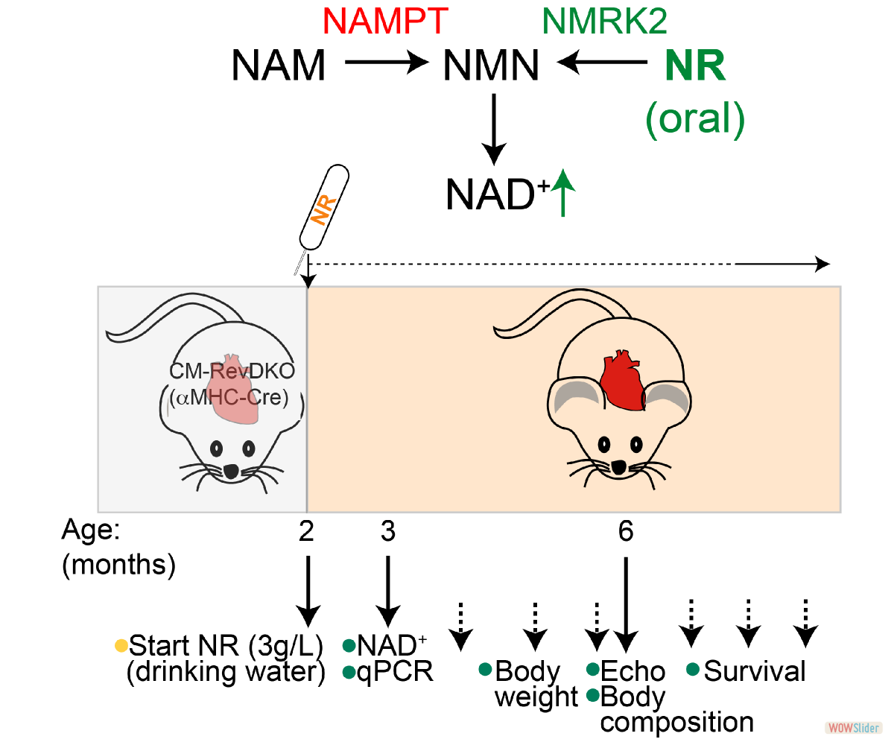</li>
		<li><a href="http://wowslider.net">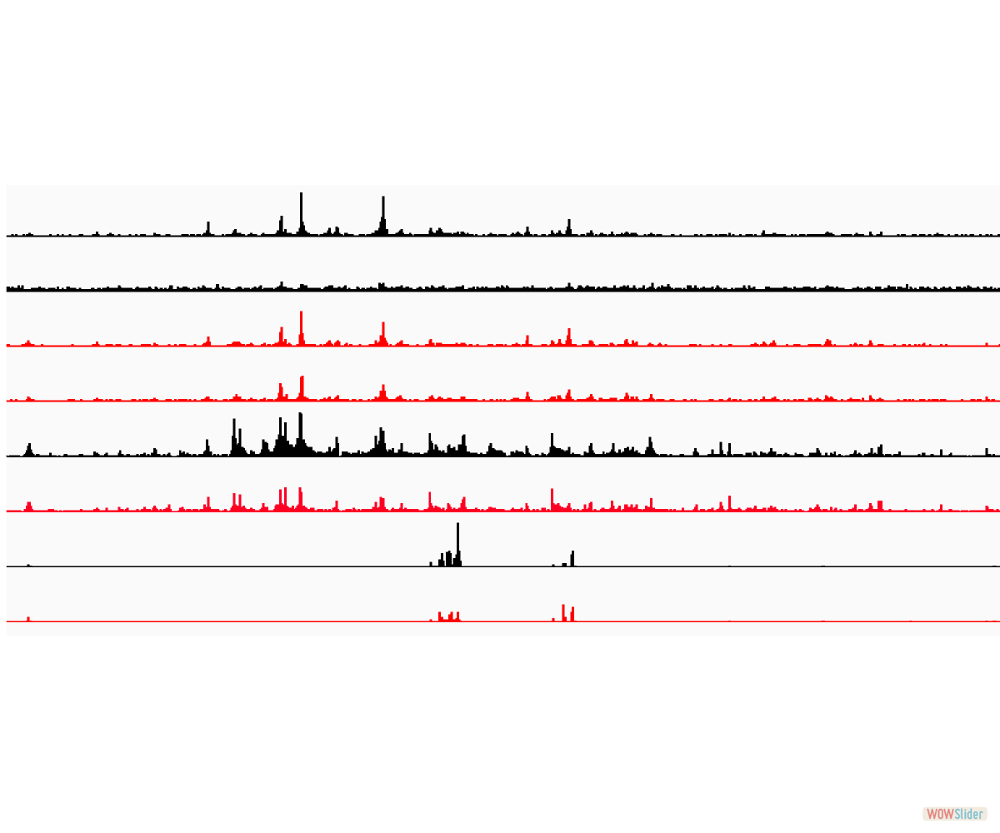</a></li>
		<li>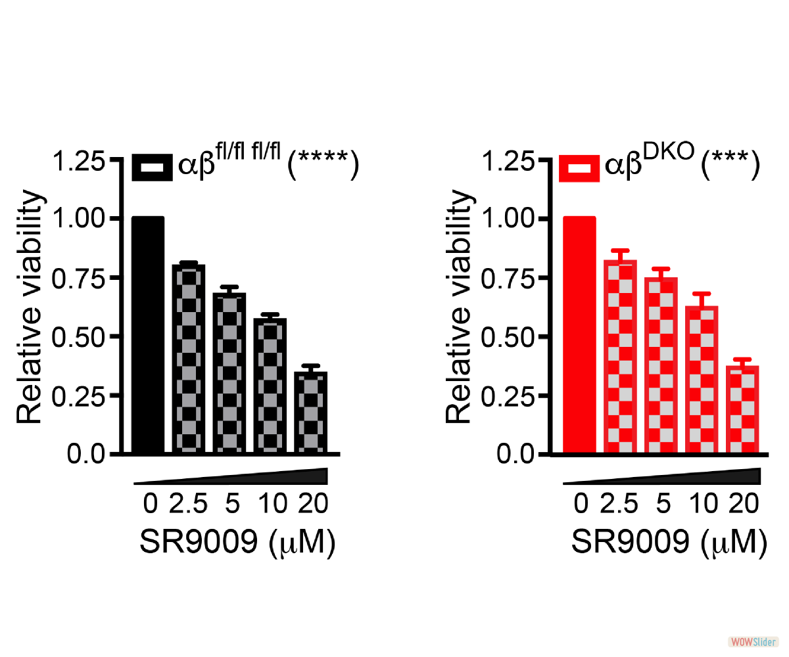</li>
	</ul>

	

		<a href="#" title="">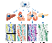1</a>
		<a href="#" title="">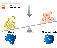2</a>
		<a href="#" title="">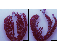3</a>
		<a href="#" title="">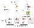4</a>
		<a href="#" title="">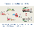5</a>
		<a href="#" title="">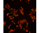6</a>
		<a href="#" title="">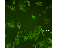7</a>
		<a href="#" title="">8</a>
		<a href="#" title="">9</a>
		<a href="#" title="">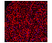10</a>
		<a href="#" title="">11</a>
		<a href="#" title="">12</a>
		<a href="#" title="">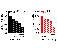13</a>
	

<a href="http://wowslider.net">javascript carousel</a> by WOWSlider.com v9.0m

	

<!-- End WOWSlider.com BODY section -->
  </body>
   
   


## Lastest News

 Last night we had a great lab outing. After some pizza and drinks, we walked over to the Colonel Night stadium through the park. The atmosphere in and outside of the stadium was electric and predictive of a good outcome. The Rote Teufels from EC Bad Nauheim beat the Ravensburg Towerstars with 3:0 and thereby evened the Play-off final series (1:1). For most of us it was our first ever live hockey game in Germany and we all had a blast. Fingers crossed the Rote Teufels will become champions, so they’ll move up to the first division.

 
   {:.center} 
   




Margaux obtained her PhD at the Université Côte d'Azur in Nice in Cellular and Molecular Interactions. In this lab, she studied how the biophysical properties of the microenvironment increase resistance mechanisms to targeted therapies in melanoma, under the supervision of Dr. Sophie Tartare-Deckert. 
In the Dierickx lab, she will use her expertise in microscopy and cell interactions to understand how the circadian clock plays a role in different cardiac cell types contributing to heart function. Outside of the lab, she enjoys reading books, hiking and traveling to discover different places.


{:.center}




