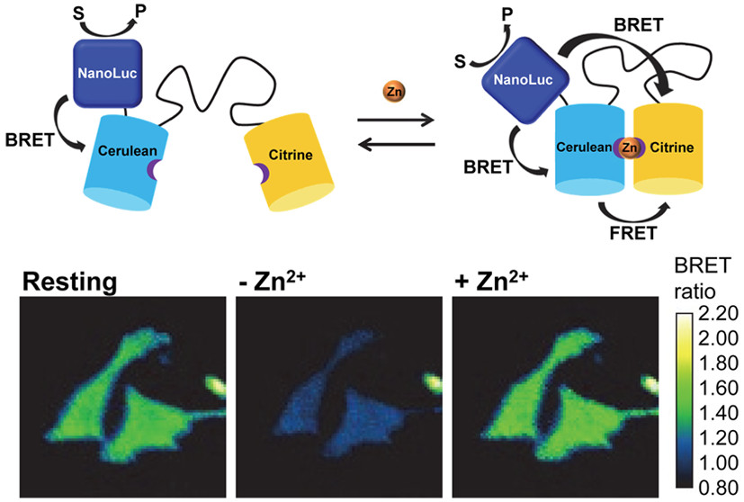

<html>
<head>

</head>
<body>
</body>
</html>

   

#  WELCOME TO OUR LAB
{:.center}

  
Circadian rhythms coordinate many different aspects of behavior and physiology (e.g., fasting/feeding cycles, body temperature and metabolism). The Dierickx lab is interested in the molecular mechanisms of the circadian clock driving rhythmic metabolic processes in the heart. We try to understand how deregulated clocks are leading to cardiovascular defects and trying to target the circadian clock in order to treat and prevent heart diseases.
   

<!-- Slideshow container -->

  <!-- Full-width images with number and caption text -->
  

    
1 / 3

    
    
Caption Text

  

  

    
2 / 3

    
    
Caption Two

  

  

    
3 / 3

    
    
Caption Three

  

  <!-- Next and previous buttons -->
  <a class="prev" onclick="plusSlides(-1)">&#10094;</a>
  <a class="next" onclick="plusSlides(1)">&#10095;</a>

 

<!-- The dots/circles -->

  
  
  

