#  WELCOME TO OUR LAB
{:.center}

  
Circadian rhythms coordinate many different aspects of behavior and physiology (e.g., fasting/feeding cycles, body temperature and metabolism). The Dierickx lab is interested in the molecular mechanisms of the circadian clock driving rhythmic metabolic processes in the heart. We try to understand how deregulated clocks are leading to cardiovascular defects and trying to target the circadian clock in order to treat and prevent heart diseases.
   

 

<head>
  <!-- Start WOWSlider.com HEAD section -->
<link rel="stylesheet" type="text/css" href="engine1/style.css" />

<!-- End WOWSlider.com HEAD section -->
 </head>

<body style="background-color:#202020;">
  <!-- Start WOWSlider.com BODY section -->

<ul>
		<li>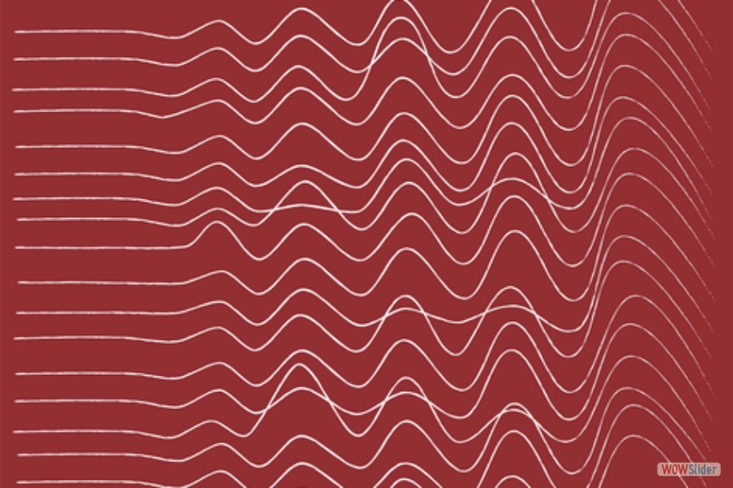</li>
		<li>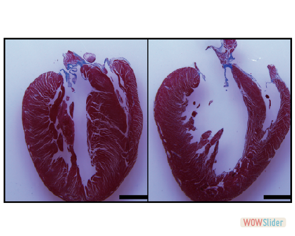</li>
		<li>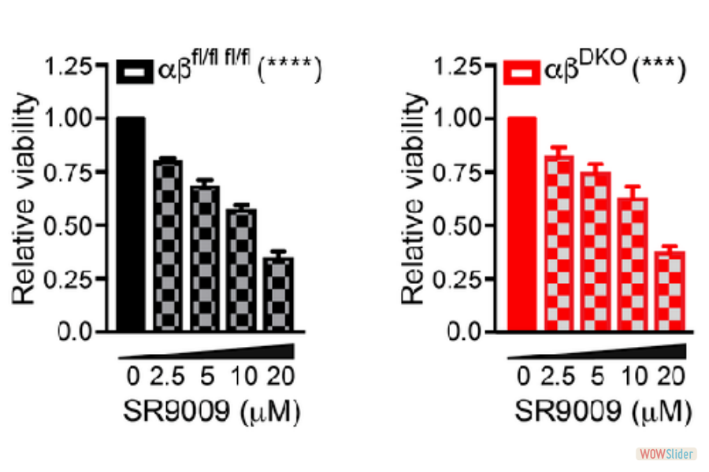</li>
		<li>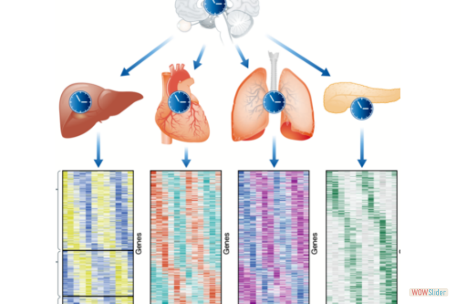</li>
		<li><a href="http://wowslider.net">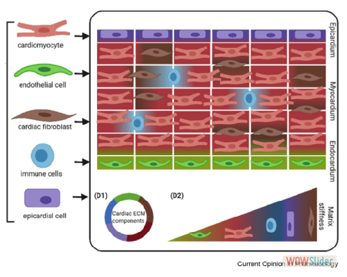</a></li>
		<li>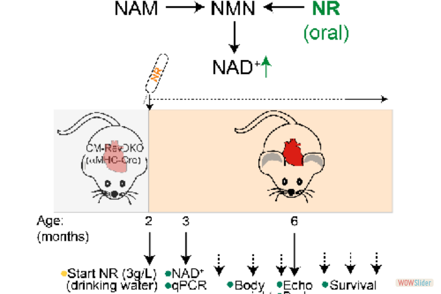</li>
	</ul>

	

		<a href="#" title="">1</a>
		<a href="#" title="">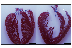2</a>
		<a href="#" title="">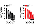3</a>
		<a href="#" title="">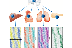4</a>
		<a href="#" title="">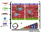5</a>
		<a href="#" title="">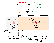6</a>
	

<a href="http://wowslider.net">responsive slider</a> by WOWSlider.com v9.0m

	

<!-- End WOWSlider.com BODY section -->
  </body>
    

